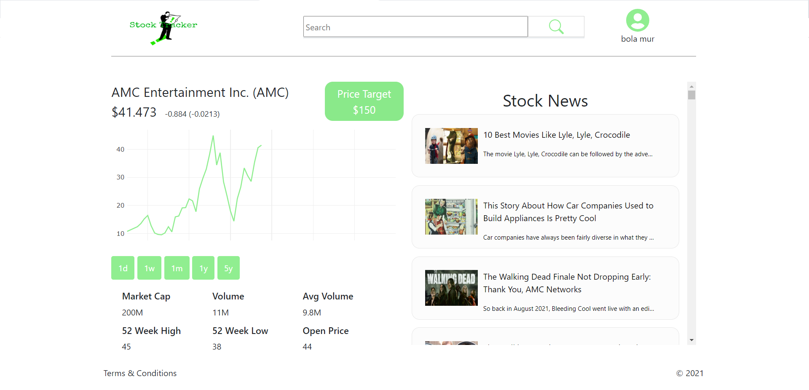

# Stock Tracker

## Table of contents

- [Overview](#overview)
  - [Screenshot](#screenshot)
  - [Live Site](#live-ssite)
- [About](#about)
  - [App Overview](#app-overview)
  - [App Overview Links](#app-overview-links)
- [Author](#author)

## Overview

### Screenshot

## Live Site

- URL: [frontendmentor-loopstudios-tailwindcss.vercel.app](frontendmentor-loopstudios-tailwindcss.vercel.app)

## About

Stock Tracker is an application which allows users to create an account and track any stock ticker in the New York Stock Exchange.

### App Overview

Stock Tracker is compromised by 5 apps, which are as follows:
  - Frontend Website(React) - the actual website where users navigate through the website and look at NYSE companies stock tickers and view the daily graph which holds the live prices of each individual stock. Users who login have the privledge to create a watchlist and track as many stock ticker in real time.

  - Server1(Node.js/Express.js) - this part of the application is in charge of sending the live data of stock tickers to the frontend application.
  
  - Server2(Node.js/Express.js) - this part of the application is in charge of checking if the stocks of users who have a watchlist have fulfilled the users price mark, and if so server2 updates the watchlist stock ticker reached.    
  
  - Server3(Node.js/Express.js) - this part of the application provides the frontend app with various routes which it can communicate to retieved/send authentication forms, stock daily, monthly, yearly or news information.
  
  - MOCKDATA(Node.js/Express.js) - this part of the application is an API created by Angel Murillo which mimics the stock market data flow.All data from MOCKDATA API is predefined and Server 1 fetches available stock live price from it, which then it serves to the frontend application. *Note: MOCKDATA was required because all stock live price API available from the web required a license, and i didnt want to break the terms and service. But if i were to pay for the API this app can function with real live data from the New York Stock Exchange.

### App Overview Links
  - Full Stack Website (MERN Stack):[github](https://github.com/csmurillo/stock-tracker)
  - Server1:[github](https://github.com/csmurillo/stock-tracker-server-1)
  - Server2:[github](https://github.com/csmurillo/stock-tracker-server-2)
  - Server3:[github](https://github.com/csmurillo/stocktracker-backend)
  - MOCKDATA:[github](https://github.com/csmurillo/MockStockAPI)

## Author

- Github [@csmurillo](https://github.com/csmurillo)

